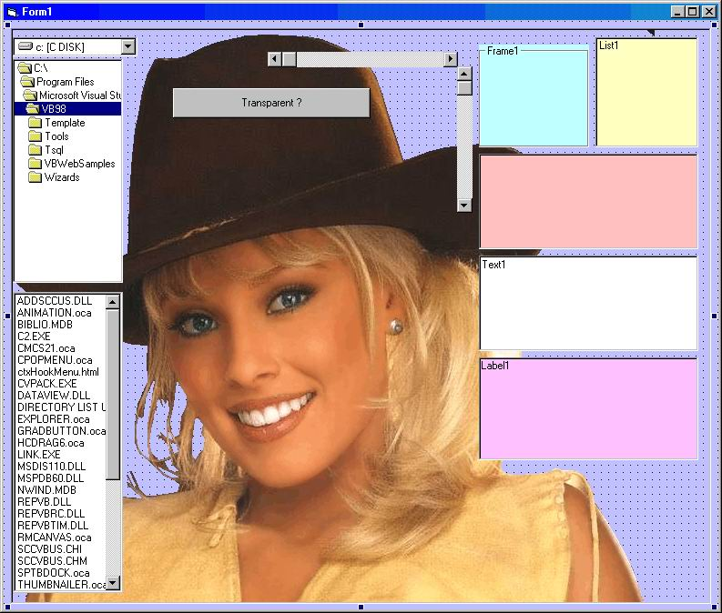



## Transparent Control Container

### Description

This Usercontrol it draws the Control's container Transparent but not the controls inside.Few lines easy to understand and very fast. No Api Calls
 
### More Info
 
Transparet Control Container

             |
---                |---
**Submitted On**   |2003-04-25 20:55:02
**By**             |[Toni](https://github.com/Planet-Source-Code/PSCIndex/blob/master/ByAuthor/toni.md)
**Level**          |Beginner
**User Rating**    |5.0 (10 globes from 2 users)
**Compatibility**  |VB 5\.0, VB 6\.0, VB Script
**Category**       |[Custom Controls/ Forms/  Menus](https://github.com/Planet-Source-Code/PSCIndex/blob/master/ByCategory/custom-controls-forms-menus__1-4.md)
**World**          |[Visual Basic](https://github.com/Planet-Source-Code/PSCIndex/blob/master/ByWorld/visual-basic.md)
**Archive File**   |[Transparen1579534252003\.zip](https://github.com/Planet-Source-Code/toni-transparent-control-container__1-45039/archive/master.zip)

